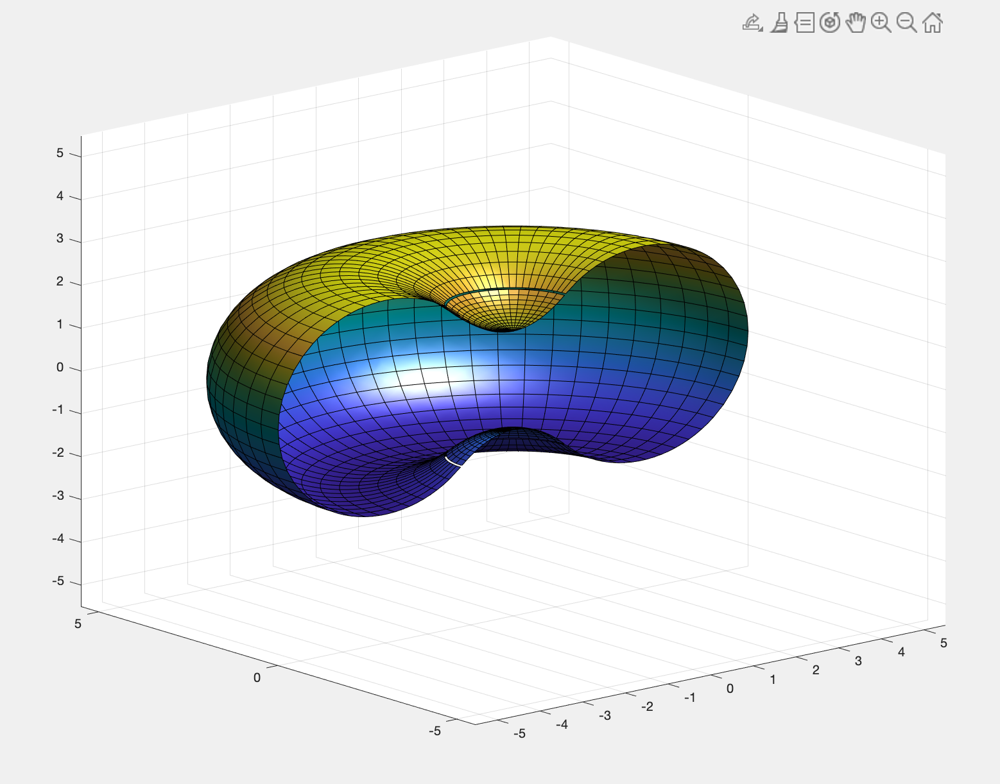
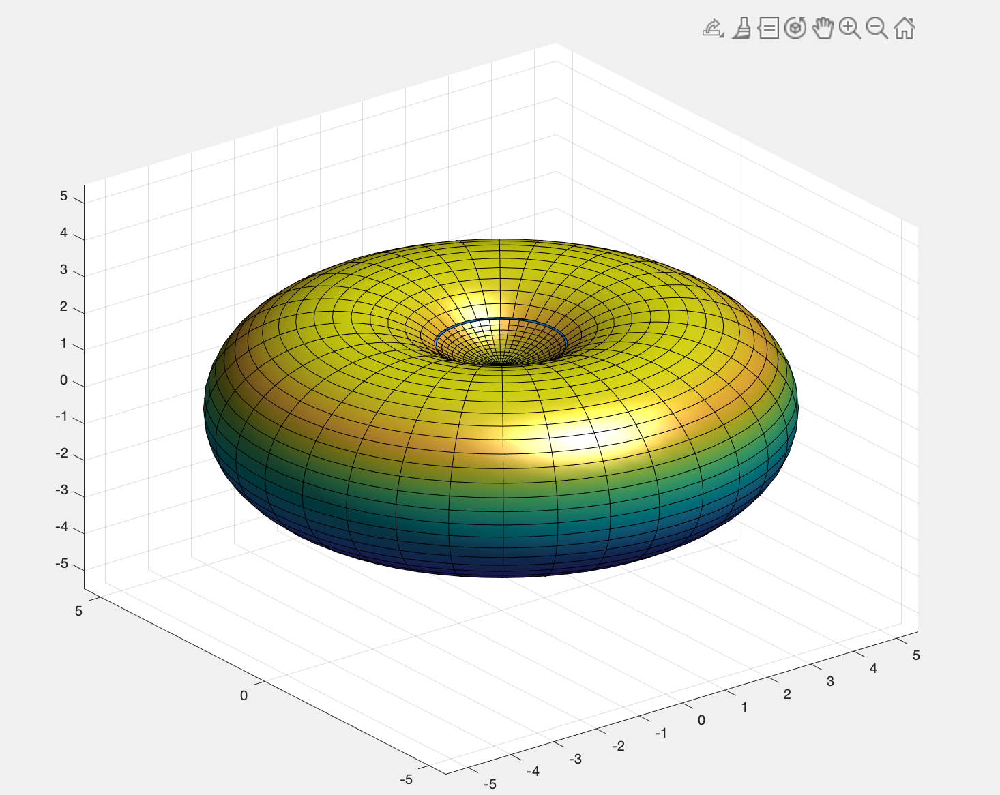

# Red-Blood-Cell-Optimization
Personal Project

Using Multivariable Calculus to optimize the dimensions of a red blood cell.

The red blood cell is modelled with a torus and 2 circular paraboloids. Then, the dimensions of the red blood cell is optimized to give the greatest surface area / volume ratio.

